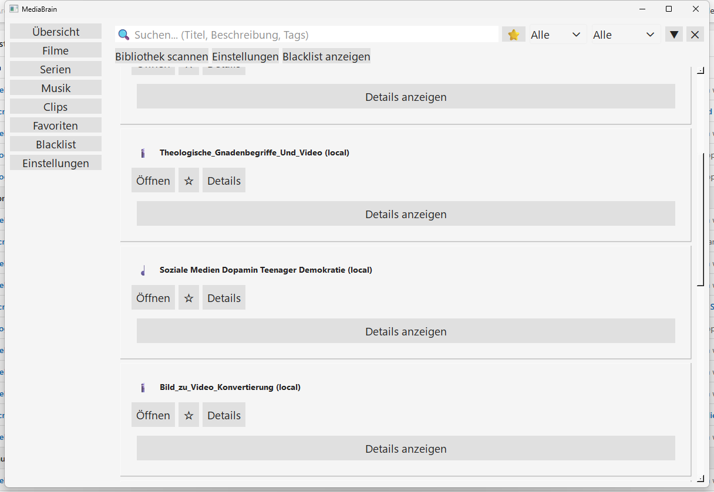

# MediaBrain

A local, privacy-friendly media hub that automatically detects, collects, organizes, and makes accessible content from all sources.
Unifies streaming services, local files, browser activity, and app usage in a single interface.

## Features

### Media Detection
- Netflix titles
- YouTube videos
- Spotify tracks
- Local files (mp3, mp4, mkv, pdf, epub ...)

### Media Management
- Favorites and blacklist (with expiration date)
- Sorting, filters, detail view
- History (created, last opened, opening method)

### Open Logic
- Browser, app deep links, local files
- Auto mode (remembers last method)

### Dashboard
- Favorites and recently opened
- Global search, statistics, quick actions

### Libraries
- Movies, series, music, clips
- Podcasts, audiobooks, documents

### Additional Features
- Light/Dark theme with dynamic switching
- Reactive refresh system (Background -> Queue -> MainThread -> GUI)
- Blacklist management with filter and duration

## Architecture

```
Core Layer       Database, MediaManager, BlacklistManager, EventProcessor
Provider Layer   Netflix, YouTube, Spotify, Local
Background Layer FileIndexer, BrowserWatcher, AppWatcher, TrayApp
GUI Layer        Dashboard, Libraries, Favorites, Blacklist, Settings
```

Full architecture diagram: [ARCH.md](ARCH.md)

## Screenshots



## Installation

### Prerequisites

- Python >= 3.8
- PyQt6

### Setup

```bash
pip install -r requirements.txt
```

### Configuration

On first launch, `settings.json` is created. A sample configuration is available in `settings.example.json`.

## Usage

```bash
python MediaBrain.py
```

Or via the batch file:

```bash
START.bat
```

## Roadmap

Open items and planned features: [ROADMAP.md](ROADMAP.md)

## License

GPL v3 - See [LICENSE](LICENSE)

This project uses PyQt6 (GPL).

---

**Author:** Lukas Geiger
**Last Updated:** March 2026

---

🇩🇪 [Deutsche Version](README.de.md)
