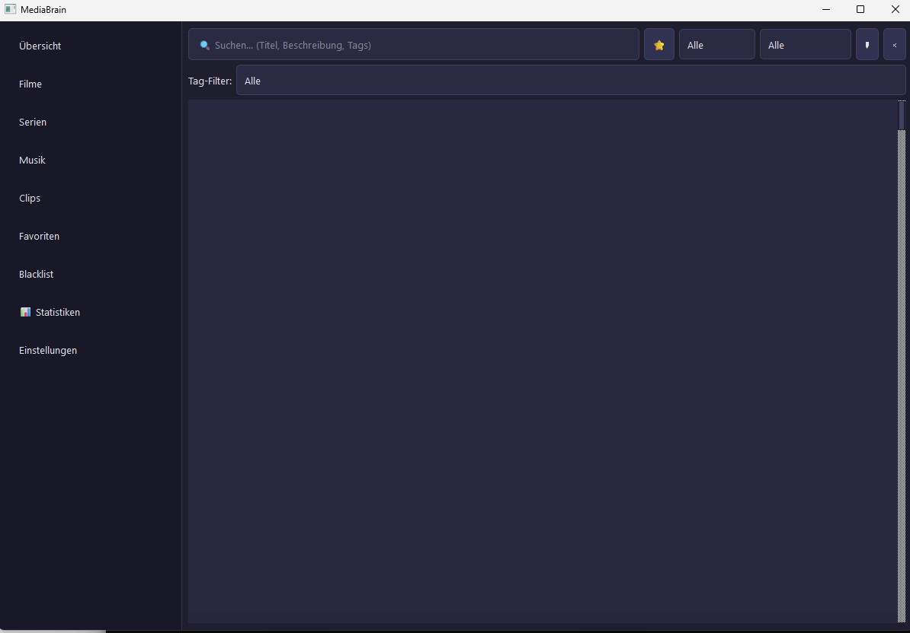

# MediaBrain

MediaBrain ist ein lokaler, datenschutzfreundlicher Media-Hub. Die Anwendung erkennt und organisiert Inhalte aus Streaming-Diensten, lokalen Dateien, Browser-Aktivität und App-Nutzung in einer einzigen PySide6-Oberfläche.

> MediaBrain is a local, privacy-friendly media hub. It detects and organizes content from streaming services, local files, browser activity, and app usage in one PySide6 desktop interface.

## Screenshots



## Funktionen / Features

- **Medienerkennung / Media Detection:** Netflix, YouTube, Spotify, Disney+, Prime, AppleTV+, Twitch und lokale Dateien.
- **Medienverwaltung / Media Management:** Favoriten, Blacklist mit Ablaufdatum, Detailansicht, Verlauf, Sortierung und Filter.
- **Playlists:** Manuelle Playlists und Smart-Playlists mit QueryBuilder-Regeln, Tag-Filtern, Sortierung und Limit.
- **Bibliotheken / Libraries:** Filme, Serien, Musik, Clips, Podcasts, Hörbücher und Dokumente.
- **Dashboard und Suche:** Favoriten, zuletzt geöffnet, globale Suche, Statistiken und Schnellaktionen.
- **Tag-System:** Tags erstellen, zuweisen und in Bibliotheken, Suche und Smart-Playlists verwenden.
- **Themes:** Hell, Dunkel und High-Contrast mit dynamischem Wechsel.
- **Offline-First:** Lokale SQLite-Datenbank und lokale Konfiguration; keine Telemetrie.
- **System Tray:** Optionales Minimieren ins Tray statt Beenden.

## Architektur / Architecture

```text
Core Layer        Database, MediaManager, BlacklistManager, TagManager, PlaylistManager
Query Layer       QueryBuilder für erweiterte Filter und Smart-Playlists
Provider Layer    Netflix, YouTube, Spotify, Disney+, Prime, AppleTV+, Twitch, Local
Background Layer  FileIndexer, WindowWatcher
GUI Layer         Dashboard, Libraries, Favorites, Blacklist, Playlists, Search, Stats, Settings
```

Vollständiges Diagramm / Full diagram: [ARCH.md](ARCH.md)

## Installation

Voraussetzungen:

- Python 3.8 oder neuer
- Windows, Linux oder macOS mit Qt/PySide6-Unterstützung

```bash
pip install -r requirements.txt
```

Beim ersten Start wird `settings.json` lokal erzeugt. Die öffentliche Vorlage liegt in [settings.example.json](settings.example.json). Persönliche Einstellungen, Datenbanken, Logs und Build-Artefakte sind per `.gitignore` ausgeschlossen.

## Nutzung / Usage

```bash
python MediaBrain.py
```

Windows-Start per Doppelklick:

```bat
START.bat
```

Ein schlanker Windows-Starter kann mit folgendem Skript gebaut werden:

```bat
build_exe.bat
```

## Tests

```bash
python -m pytest tests/ -q
```

Die Tests decken Datenbankmanager, Metadaten, Tags, QueryBuilder, Playlists und die Playlist-GUI im Offscreen-Modus ab.

## Datenschutz / Privacy

MediaBrain speichert Nutzungsdaten lokal in SQLite-Dateien und Konfigurationsdateien. Es gibt keine Telemetrie und keine automatische Cloud-Synchronisation. Optionale Metadatenabfragen nutzen nur die vom Nutzer konfigurierten TMDb-/OMDb-API-Keys oder öffentliche MusicBrainz-Daten. Details stehen in [PRIVACY_POLICY.md](PRIVACY_POLICY.md).

## Roadmap

Siehe [ROADMAP.md](ROADMAP.md).

## Lizenz / License

GPL v3, siehe [LICENSE](LICENSE). Die GUI basiert auf PySide6 (LGPL).

---

**Autor:** Lukas Geiger

**Zuletzt aktualisiert:** Mai 2026

## Haftung / Liability

Dieses Projekt ist eine unentgeltliche Open-Source-Schenkung im Sinne der §§ 516 ff. BGB. Die Haftung des Urhebers ist gemäß § 521 BGB auf Vorsatz und grobe Fahrlässigkeit beschränkt. Ergänzend gelten die Haftungsausschlüsse aus GPL-3.0.

Nutzung auf eigenes Risiko. Keine Wartungszusage, keine Verfügbarkeitsgarantie, keine Gewähr für Fehlerfreiheit oder Eignung für einen bestimmten Zweck.

This project is an unpaid open-source donation. Liability is limited to intent and gross negligence (§ 521 German Civil Code). Use at your own risk. No warranty, maintenance guarantee, or fitness-for-purpose is assumed.
