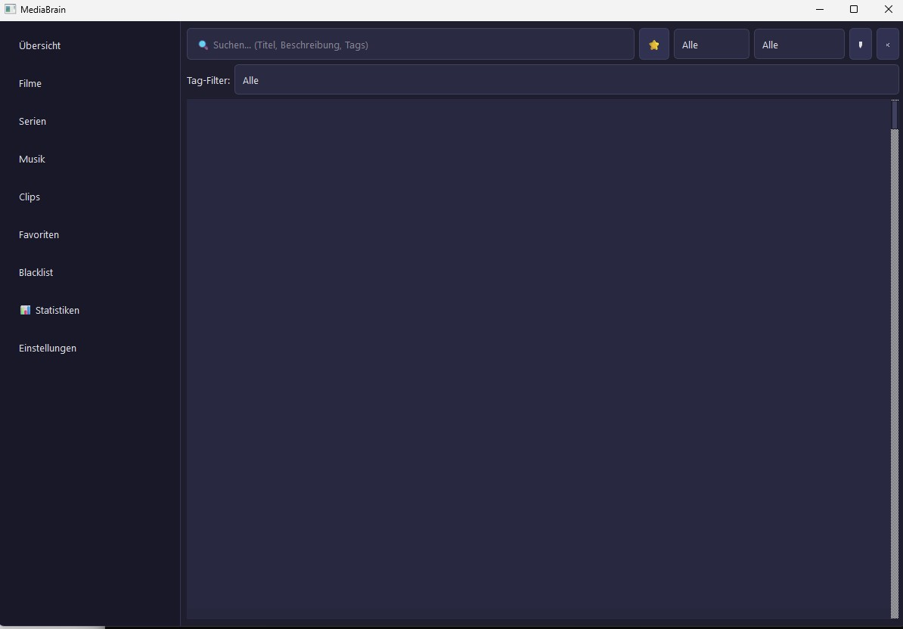

# MediaBrain

[](version.py)
[](LICENSE)
[](https://www.python.org/)
[]()
[]()
[]()
[](https://github.com/doc-bricks)
[](https://github.com/open-bricks)
[](llms.txt)

> **MediaBrain is a local-first PySide6 media library manager for personal video, music, playlist, and streaming-watch history.**

> [!NOTE]
> **AI / Agent Context**: Machine-readable repo architecture, file indexes, search phrases, and system boundaries are available in [llms.txt](llms.txt).

**[English](README.md)** | [Deutsch](README_de.md) | [Privacy](PRIVACY_POLICY.md) | [Contributing](CONTRIBUTING.md) | [Changelog](CHANGELOG.md)



## Start Here

| Need | Go to |
|---|---|
| Run the desktop app | `python MediaBrain.py` |
| Inspect the Flutter mobile line | `flutter_port/README.md` |
| Check privacy boundaries | [PRIVACY_POLICY.md](PRIVACY_POLICY.md) |
| Understand the architecture | [ARCH.md](ARCH.md) |
| Review planned work | [ROADMAP.md](ROADMAP.md) |
| Get machine-readable context | [llms.txt](llms.txt) |

## Why MediaBrain

MediaBrain is for people who want one local place for media they watch, collect, tag, blacklist, or organize across services and local files. It is not a hosted streaming service and it does not upload a private library to a cloud account.

- Local SQLite storage for media entries, favorites, tags, blacklist items, and playlists
- PySide6 desktop UI with dashboard, libraries, search, statistics, settings, and high-contrast themes
- Provider layer for Netflix, YouTube, Spotify, Disney+, Prime Video, Apple TV+, Twitch, and local files
- Manual playlists and smart playlists backed by QueryBuilder rules
- Optional metadata lookup through user-configured TMDb/OMDb keys or public MusicBrainz data
- No telemetry, no tracking, and no automatic cloud sync

## Search Context

This repository is the canonical GitHub home for:

- `doc-bricks MediaBrain`
- `MediaBrain media library manager`
- `private SQLite media library manager`
- `local-first PySide6 media manager`
- `PySide6 smart playlist media manager`
- `offline media hub with smart playlists`
- `desktop media history tracker`
- `privacy-first media history desktop app`

The name "MediaBrain" collides with media analytics companies, AI media labs, and generic media-planning tools. This repository is specifically the `doc-bricks/MediaBrain` local-first desktop media library, not a cloud advertising analytics platform, a multimedia research lab, or an AI media generator.

## Architecture

```text
Core Layer        Database, MediaManager, BlacklistManager, TagManager, PlaylistManager
Query Layer       QueryBuilder for advanced filters and smart playlists
Provider Layer    Netflix, YouTube, Spotify, Disney+, Prime, AppleTV+, Twitch, Local
Background Layer  FileIndexer, WindowWatcher
GUI Layer         Dashboard, Libraries, Favorites, Blacklist, Playlists, Search, Stats, Settings
```

Full diagram: [ARCH.md](ARCH.md)

## Ecosystem & Sibling Tools

MediaBrain is part of the [`doc-bricks`](https://github.com/doc-bricks) document and productivity suite under the [`open-bricks`](https://github.com/open-bricks) umbrella:

| Tool | Focus | Repository |
|---|---|---|
| **MediaBrain** | Local-first media history, smart playlists & library management | [doc-bricks/MediaBrain](https://github.com/doc-bricks/MediaBrain) |
| **CleanMarkdown** | Typography normalizer, markdown cleaner & PDF exporter | [doc-bricks/CleanMarkdown](https://github.com/doc-bricks/CleanMarkdown) |
| **PDFtoPDFocr** | Searchable PDF OCR pipeline & metadata extractor | [doc-bricks/PDFtoPDFocr](https://github.com/doc-bricks/PDFtoPDFocr) |
| **llm-note** | Markdown notepad with local LLM assistant integration | [doc-bricks/llm-note](https://github.com/doc-bricks/llm-note) |
| **LaunchBoards** | Visual launcher, app organizer & dashboard workstation | [file-bricks/LaunchBoards](https://github.com/file-bricks/LaunchBoards) |
| **ProFiler** | Privacy-focused file analyzer, inspector & deduplicator | [file-bricks/ProFiler](https://github.com/file-bricks/ProFiler) |
| **KnowledgeDigest** | Offline knowledge base & documentation compressor | [file-bricks/KnowledgeDigest](https://github.com/file-bricks/KnowledgeDigest) |
| **WinStorePackager** | MSIX packaging, store manifest staging & asset generator | [file-bricks/WinStorePackager](https://github.com/file-bricks/WinStorePackager) |
| **DevCenter** | Multi-repo developer dashboard, CI monitor & workspace manager | [dev-bricks/DevCenter](https://github.com/dev-bricks/DevCenter) |
| **open-bricks** | Unified umbrella portal across all desktop and CLI tools | [open-bricks/open-bricks](https://github.com/open-bricks/open-bricks) |

## Installation

Requirements:

- Python 3.10 or newer
- Windows, Linux, or macOS with Qt/PySide6 support

```bash
pip install -r requirements.txt
```

On first launch, MediaBrain creates `settings.json` locally. The public template is [settings.example.json](settings.example.json). Personal settings, databases, logs, and build artifacts are excluded through `.gitignore`.

## Usage

```bash
python MediaBrain.py
```

Read-only command line access (never writes to the database):

```bash
python cli.py list
python cli.py search "title"
python cli.py --db /path/to/media_brain.db types
```

The CLI suppresses blacklisted entries. Set `MEDIABRAIN_DB` or use `--db` to
select a database explicitly.

Windows double-click launcher:

```bat
START.bat
```

A lightweight Windows launcher can be built with:

```bat
build_exe.bat
```

## Tests

```bash
python -m pytest tests/ -q
```

The test suite covers database managers, metadata, tags, QueryBuilder, playlists, and playlist GUI behavior in offscreen mode.

The dedicated source-platform smoke exercises Unicode paths, configuration,
JSON exchange, the operating-system file opener, and the offscreen window/tray
lifecycle:

```bash
python -m pytest tests/source_platform_smoke.py -q
```

GitHub Actions runs that focused smoke on Ubuntu and macOS. It is a source and
offscreen-GUI contract, not proof of native packaging, a desktop-session tray,
or manual acceptance on either platform.

## Privacy

MediaBrain stores usage data locally in SQLite databases and configuration files. It has no telemetry and no automatic cloud sync. Optional metadata requests use only user-configured TMDb/OMDb API keys or public MusicBrainz data. Details: [PRIVACY_POLICY.md](PRIVACY_POLICY.md).

## License

MIT, see [LICENSE](LICENSE). Direct third-party runtime and development dependencies are inventoried in [THIRD_PARTY_LICENSES.txt](THIRD_PARTY_LICENSES.txt). The GUI uses PySide6 under LGPL terms.

## Liability

This project is provided free of charge and "as is", without warranty, maintenance guarantee, or fitness-for-purpose guarantee. Use it at your own risk.
